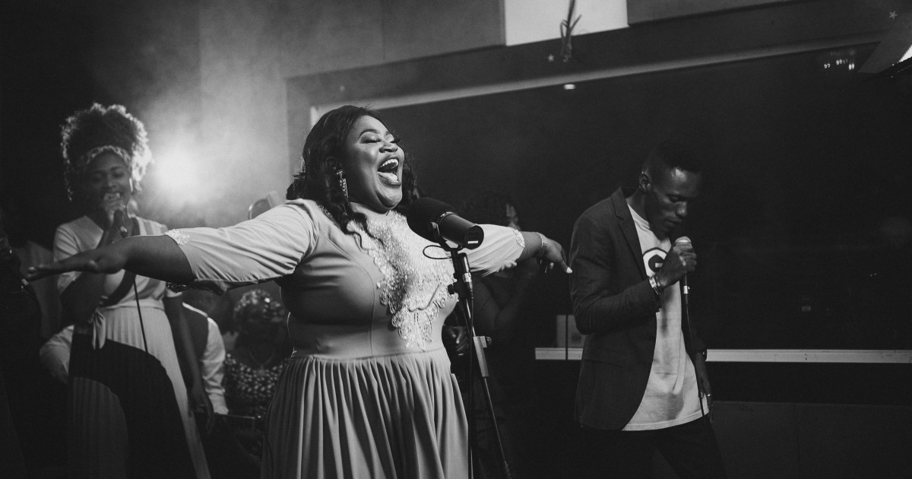

# Peace Iniolu Oba's Tribute Website

This repo contains source code for the tribute website to Peace Iniolu Oba, honoring their life and legacy.

## Getting Started

These instructions will get you a copy of the project up and running on your local machine for development and testing purposes.

### Prerequisites

You will need to have Node.js and npm (Node Package Manager) installed on your machine.

### Installing

1. Clone this repository: `git clone https://github.com/huboh/peace-iniolu-oba-tribute.git`
2. Navigate to the project directory: `cd peace-oba-tribute`
3. Install the dependencies: `npm install`
4. Start the development server: `npm run dev`

## Built With

- [Next.js](https://nextjs.org/)
- [TypeScript](https://www.typescriptlang.org/)
- [PocketBase](https://github.com/pockethq/pocketbase)

## License

This project is licensed under the MIT License - see the [LICENSE](https://github.com/huboh/peace-iniolu-oba-tribute/blob/main/LICENSE) file for details.

## Acknowledgments

We would like to extend our sincerest thanks to the following individuals and organizations for their contributions to this project:

- [Mr Gbenga Oba](https://instagram.com/mrgbengaoba?igshid=YmMyMTA2M2Y=) for sharing their knowledge with us, providing insightful feedback and suggestions throughout the development process.
- [Cindy](https://instagram.com/_cindyway?igshid=YmMyMTA2M2Y=) whose creative vision and direction, combined with their meticulous attention to detail, have transformed our ideas into a truly remarkable reality.
- [Jabowak Imagery](https://instagram.com/jabbowakimagery?igshid=YmMyMTA2M2Y=) for providing professional images for the project/tribute website.

## Authors

- Knowledge - [Twitter](https://twitter.com/from_Godfather) [Github](https://github.com/huboh)
- Ctechway - [Instagram](https://instagram.com/ctechway?igshid=ZDdkNTZiNTM=)

Thank you all for your support and for helping us make this project a success!
